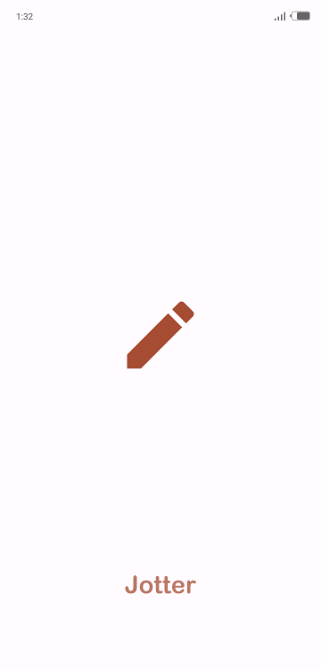
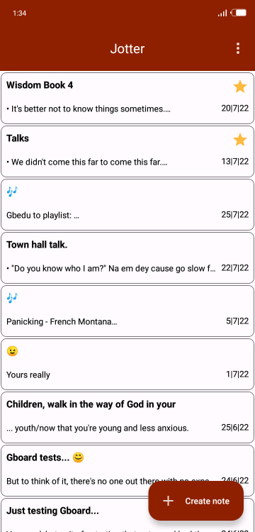
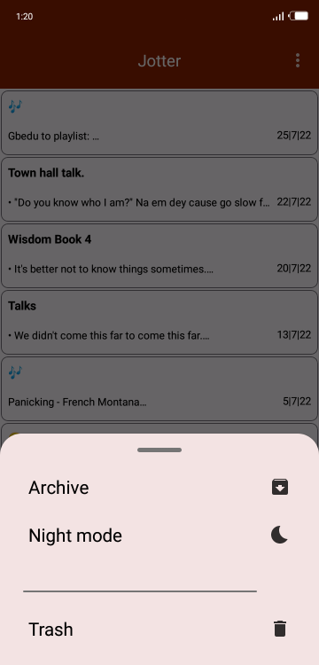
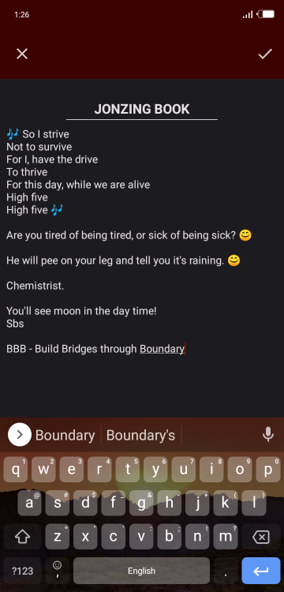
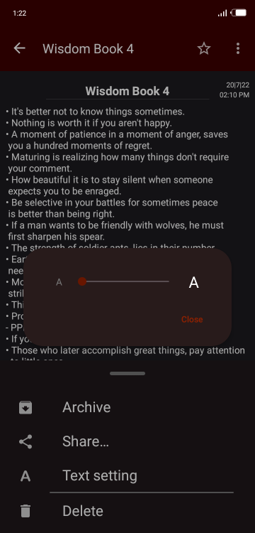
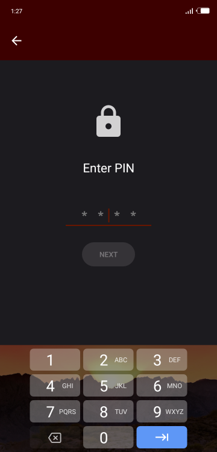

# Jotter
A "jotter" or notebook app. Jotter allows you jot things down in style, while keeping it private.

 ## Features
  * An encryptable archive.
  * Light or dark appearance toggleable in app.
  * Share notes across all platforms.
  * Swipe to archive - allows you archive notes like a pro.
  * Adjust text size to your taste.

 ## Screenshots
  
  
  

  * Other screens in Dark Mode
  
  
  

  * More screenshots are in the [screenshots folder](screenshots)

 ## Libraries
  * [Jetpack's Navigation](https://developer.android.com/guide/navigation)
  * [Room](https://developer.android.com/jetpack/androidx/releases/room)
  * [Kotlin Coroutines](https://developer.android.com/kotlin/coroutines)
  * [View Binding](https://developer.android.com/topic/libraries/view-binding)
  * [Data Binding](https://developer.android.com/topic/libraries/data-binding)
  * Other Android Architectural Components ([ViewModel](https://developer.android.com/topic/libraries/architecture/viewmodel), [LiveData](https://developer.android.com/topic/libraries/architecture/livedata))
